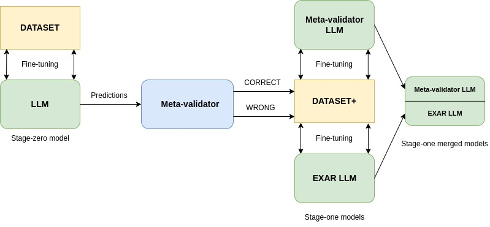

# EXclusive-AutoRegressive (EXAR) fine-tuning/prompting

This is the repository of the Python (3.10+) implementation for the Exclusive-Autoregressive fine-tuning/prompting of LLama-chat, for metacognitive LLMs building focused on Question-Answering.



# Installation

### Pandas 

```sh
> pip install pandas
> pip install openpyxl
```

### Pytorch

Follow the instructions reported [here](https://pytorch.org/) for the current system.

### Llama 2 

* Download **Llama-2-7b-chat-hf** (or 70b) from [huggingface](Llama-2-7b-chat-hf) and copy it in a local folder. 

### QLoRA

```sh
> pip install transformers==4.34.0
> pip install peft==0.4.0
> pip install sentencepiece==0.1.99
> pip install datasets==2.13.0
> pip install accelerate==0.23.0
> pip install bitsandbytes==0.41.1
> pip install trl==0.4.7
> pip install safetensors>=0.3.1
> pip install scipy
```

# Code usage

This repository contains source code to fine-tune and evaluate all models involved to test the performance of *EXAR* fine-tuning/prompting:


## *stage-zero* fine-tuning

This code was designed to build a new fine-tuned [QLoRa](https://arxiv.org/abs/2305.14314) instance of **Llama-2-7b-chat-hf** for the task of 
Question-Answering on [databricks/dolly-v2-12b](https://huggingface.co/databricks/dolly-v2-12b) (referred as **DATASET**).

* filename: [llama_2_ft_dolly_lora.py](https://github.com/cfabiolongo/elicit-meta-llm/blob/master/llama_2_ft_dolly_lora.py)

Relevant parameters:
 
* Training epochs
* Learning rate
* Path fine-tuned model 


## *stage-zero* evaluation

This code was designed to evaluate #match (morphological) and [BERTScore](https://huggingface.co/spaces/evaluate-metric/bertscore) for a test set o 100 (or more) items from dolly.
The code can optionally save all predictions in a **pre-DATASET+**.

* filename: [llama_2_ft_bertscore_dolly.py](https://github.com/cfabiolongo/elicit-meta-llm/blob/master/llama_2_ft_bertscore_dolly.py)

Relevant parameters:
 
* Input path fine-tuned model
* Temperature value
* Output path for **pre-DATASET+** (optional)


## *stage-zero* DATASET+ annotations

This code is for annotating **pre-DATASET+** with evaluations leveraging BERT-score, in order to build **DATASET+**.

* filename: [check_dollypreds.py](https://github.com/cfabiolongo/elicit-meta-llm/blob/master/check_dollypreds.py)

Relevant parameters:
 
* Validation F1-score treshold.
* Other thresholds
* Output Path fine-tuned model 

## *stage-one* meta-validator fine-tuning

The following code is for building a new fine-tuned [QLoRa](https://arxiv.org/abs/2305.14314) instance of **Llama-2-7b-chat-hf** for the task of
validation on the predictions of *stage-zero* (**DATASET+**).

* filename: [llama_2_ft_metadolly_lora.py](https://github.com/cfabiolongo/elicit-meta-llm/blob/master/llama_2_ft_metadolly_lora.py)

Relevant parameters:
 
* Input excel **DATASET+**
* Training epochs
* Learning rate
* Path fine-tuned model 

## *stage-one* meta-validator evaluation

The following code is aimed to evaluate meta-evaluation on single adapter, from a test set of 100 items from **DATASET+**.

* filename: [llama_2_ft_eval_metadolly.py](https://github.com/cfabiolongo/elicit-meta-llm/blob/master/llama_2_ft_eval_metadolly.py)

Relevant parameters:
 
* Input excel **DATASET+**
* Temperature value
* Input path fine-tuned meta-validator model


## *stage-one* EXAR fine-tuning

The following code is aimed to fine-tune an instance **Llama-2-7b-chat-hf** for the task of  
Question-Answering on **DATASET+**, by leveraging the exclusive-autoregressive (EXAR) prompt.

* filename: [llama_2_ft_dollycontext4_lora.py](https://github.com/cfabiolongo/elicit-meta-llm/blob/master/llama_2_ft_dollycontext4_lora.py)

Relevant parameters:

* Input excel **DATASET+**
* Training epochs
* Learning rate
* Path fine-tuned model 

An example item from such fine-tuning is depicted in the following picture:


## *stage-one* EXAR evaluation

The same code for above stage-zero evaluation can be used to evaluate EXAR evaluation for single adapter, on a test set o 100 (or more) items from dolly.
The code can optionally save all predictions in a **pre-stageX-DATASET+** (with X subsequent of one).

Relevant parameters:

* Input path fine-tuned EXAR model
* Temperature value
* Output path for **pre-stageX-DATASET+** (optional)

## merged *stage-one* meta-validator/EXAR evaluation: 

The following code is to evaluate the overall meta-cognitive performance of merged adapters meta-validator/EXAR in a single physical object.

* filename: [llama_2_ft_bertcontext_dolly_pipe.py](https://github.com/cfabiolongo/elicit-meta-llm/blob/master/llama_2_ft_bertcontext_dolly_pipe.py)

Relevant parameters:

* Input path fine-tuned EXAR model
* Input path fine-tuned meta-validator model
* Combination type (svd/linear/cat)
* Combination weights
* Metavalidation (True/False)
* Autoregressive (True/False)
* Temperature value for for Meta-validation
* Temperature value for the first prediction
* Temperature values for additional predictions after *False* Meta-validation
* Output path for **pre-stagetwo-DATASET+** (optional)